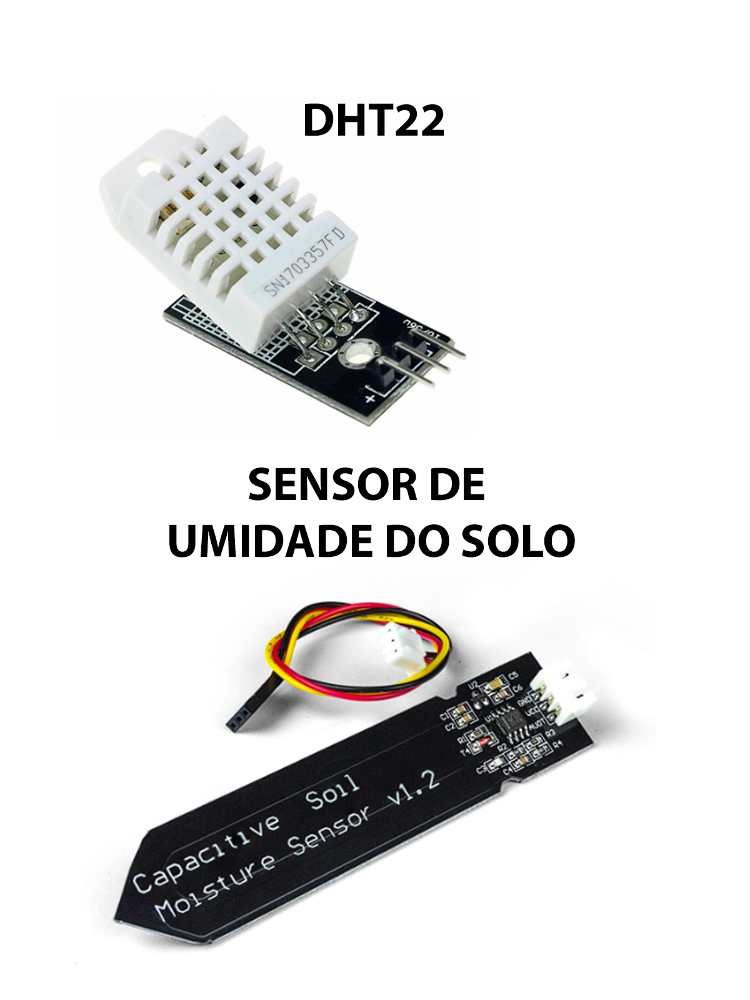
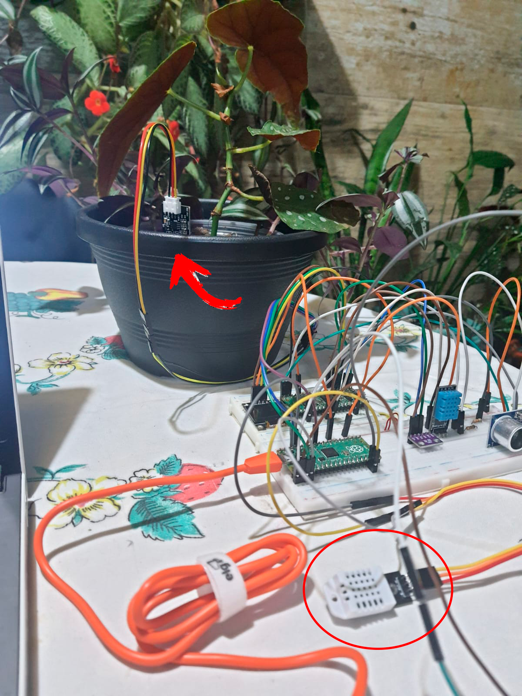

# Projeto: Monitoramento de Umidade do Solo com Raspberry Pi Pico com MicroPython

## Descrição

Este projeto tem como objetivo criar um dispositivo simples que monitora a umidade do solo e relata os dados em tempo real. Isso pode ser usado como parte de um sistema de monitoramento de Cultivo Agrícola, Agricultura de Precisão, Agricultura Urbana, Monitoramento Ambiental e uma infinidade de aplicações.

## Componentes Necessários

- Raspberry Pi Pico
- Sensor de umidade do solo (por exemplo, um sensor de umidade do solo capacitivo)
- Sensor DHT22, temperatura e umidade
- Fios de conexão
- Um computador com MicroPython configurado

## Breve Explicação do Código

- Esse código Python é um programa para coletar dados de sensores conectados a um Raspberry Pi Pico e determinar o estado do solo com base nas leituras. Aqui está uma breve explicação do que o código faz:

- Importa as bibliotecas necessárias, incluindo "machine" para acessar os pinos do Raspberry Pi Pico, "dht" para lidar com o sensor DHT22 e "time" para pausas.

- Define os pinos aos quais os sensores estão conectados. O sensor de solo é conectado a um pino analógico (ADC), e o sensor DHT22 é conectado a um pino digital.

- Inicializa o objeto DHT22 para permitir a leitura de temperatura e umidade.

- Define uma função coletar_media_sensor_solo(pin, num_amostras) que coleta leituras do sensor de solo e do sensor DHT22 ao longo de várias amostras. Ele calcula a média dessas leituras e imprime os resultados na tela.

- Define uma função determinar_estado_solo(leitura) que determina o estado do solo com base na leitura do sensor de solo. Se a leitura estiver abaixo de um limite (threshold_umido), o solo é considerado úmido; se estiver acima de outro limite (threshold_seco), o solo é considerado seco; caso contrário, é considerado intermediário.

- Na função main(), exibe uma mensagem introdutória e, em seguida, chama a função coletar_media_sensor_solo() para iniciar a coleta de dados.

- Finalmente, verifica se o script está sendo executado como o programa principal (não importado como um módulo) e, se for o caso, chama a função main() para iniciar a coleta de dados.

- No geral, o código coleta leituras de sensores de solo e umidade e calcula uma média ao longo de várias amostras, além de determinar o estado do solo (úmido, seco ou intermediário) com base nas leituras do sensor de solo. Os resultados são impressos no console da IDE.

- EXEMPLO DE CÓDIGO PARA MONITORAMENTO:

    [MONITORAMENTO DE UMIDADE DO SOLO - PI PICO](codigo/Monitor_Umidade_Solo.py)

- Código adptado da Versão para Arduino para Pi Pico com Micropython.

    Fonte Original Código para Arduino:

    https://www.robocore.net/tutoriais/leitura-umidade-solo

Sinta-se à vontade para personalizar e adaptar o código de acordo com suas necessidades específicas.

Este código é versátil e pode ser aplicado em várias situações que requerem monitoramento do solo, temperatura e umidade, abrangendo diversas aplicações:

Agricultura de Precisão, Agricultura Urbana, Monitoramento Ambiental, Automação Residencial, Projetos Educacionais, Monitoramento de Condições Climáticas, Qualidade do Solo, Projetos DIY (Faça Você Mesmo)

