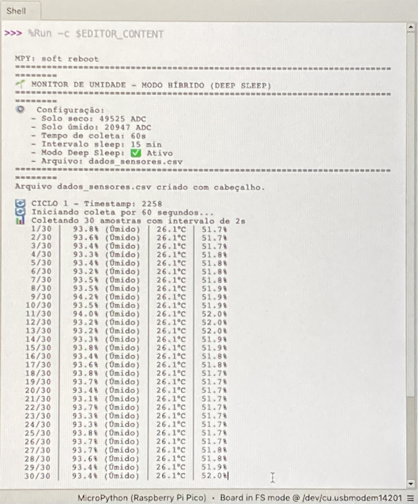
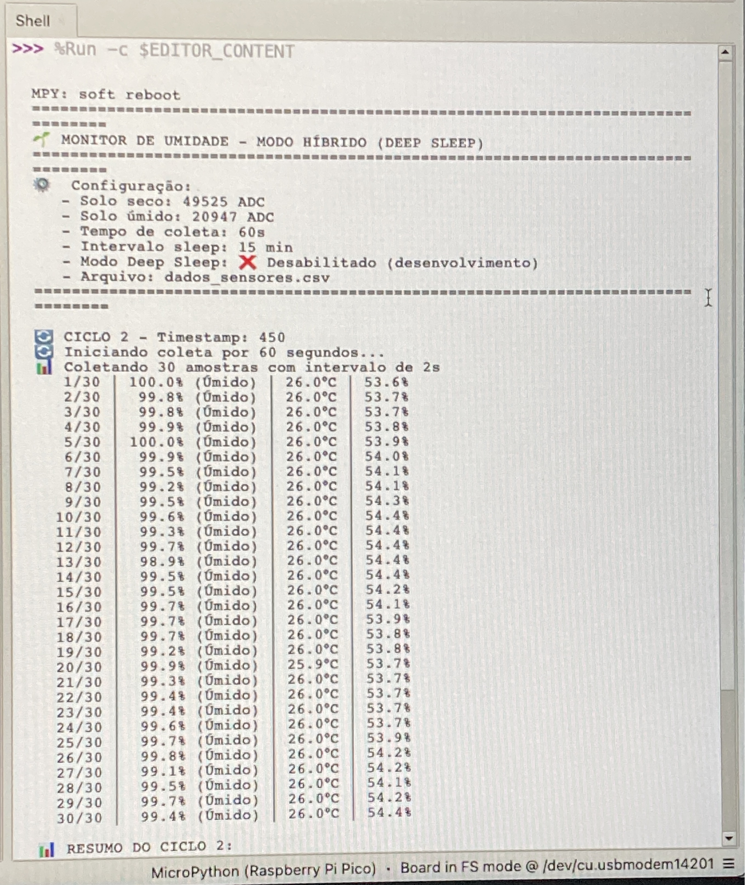
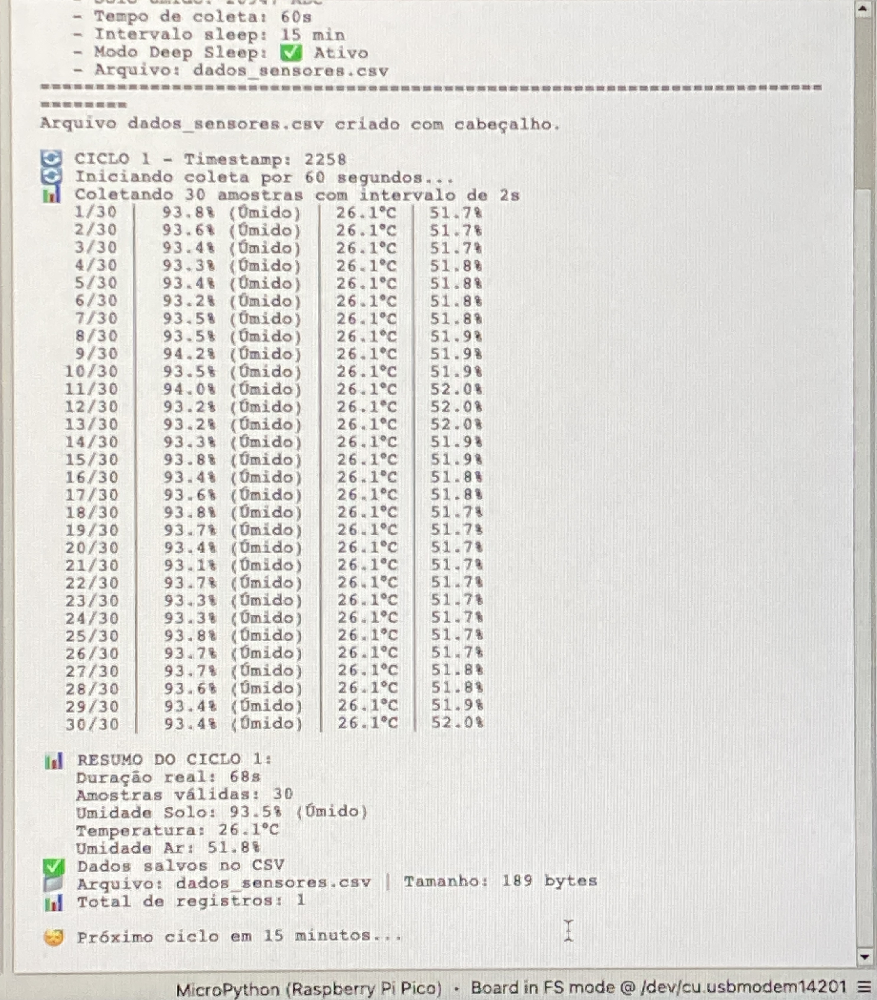
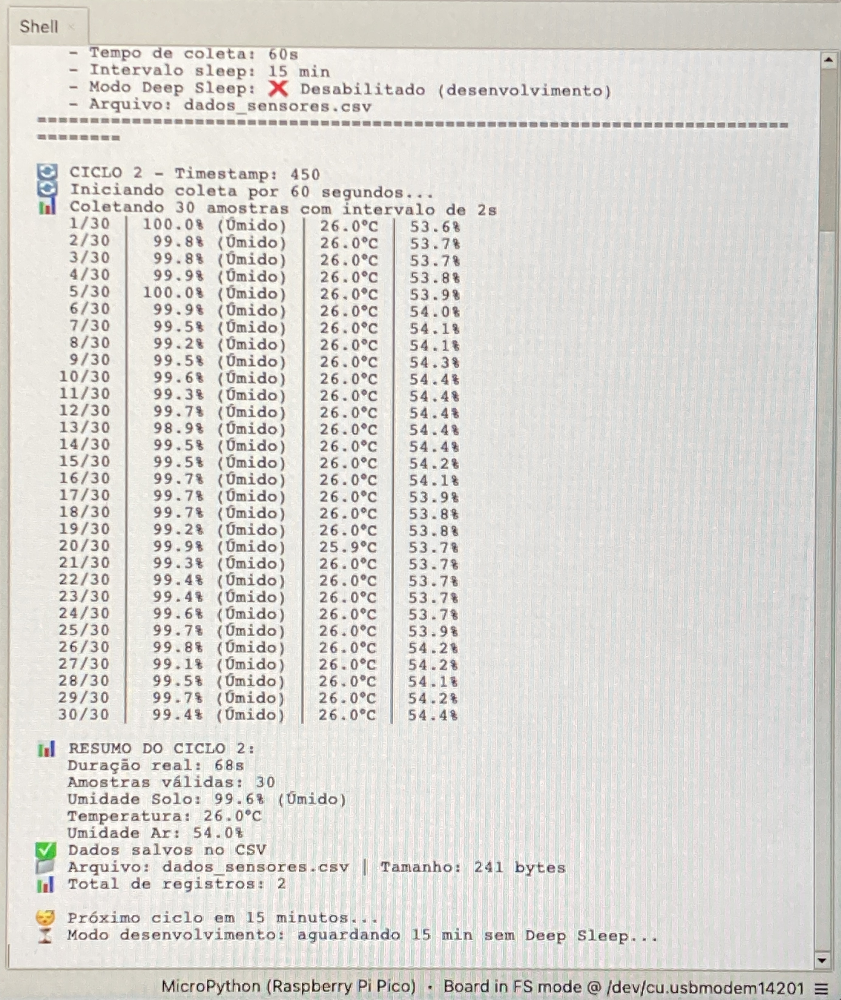

# Projeto: Monitoramento de Umidade do Solo com Raspberry Pi Pico e MicroPython

## 📌 Descrição

Este projeto implementa um sistema de **monitoramento de umidade do solo** utilizando **Raspberry Pi Pico** e **MicroPython**.  
Os dados de **umidade do solo**, **temperatura do ar** e **umidade relativa do ar** são coletados e armazenados em arquivo `.csv` para consulta posterior.  

A aplicação pode ser usada em:
- 🌱 Agricultura de Precisão  
- 🌿 Agricultura Urbana  
- 🌍 Monitoramento Ambiental  
- 🏠 Automação Residencial  
- 📚 Projetos Educacionais e DIY  

---

## 🛠️ Componentes Necessários

- Raspberry Pi Pico ou Pico W  
- Sensor de umidade do solo capacitivo (analógico)  
- Sensor DHT22 (temperatura e umidade do ar)  
- Jumpers e protoboard  
- Fonte USB ou bateria  


---

## ⚡ Principais Funcionalidades do Código Atual

### ✅ Melhorias Implementadas
- **Conversão da leitura ADC em % de umidade do solo** (0% = seco, 100% = saturado).  
- **Calibração personalizável**:
  - Funções para calibrar valores de solo totalmente seco ou totalmente úmido.  
- **Estado do solo classificado automaticamente**: `Seco`, `Úmido` ou `Intermediário`.  
- **Armazenamento em CSV otimizado**:
  - Arquivo único (`dados_sensores.csv`) criado automaticamente.  
  - Registro resumido por ciclo com **timestamp**, **médias consolidadas**, número de amostras e estado do solo.  
- **Modo Híbrido (Deep Sleep)**:
  - Durante testes via USB: usa `time.sleep()` normal (**MODO_DEEP_SLEEP = False**).  
  - Em bateria: usa `machine.deepsleep()` (**MODO_DEEP_SLEEP = True**) para economia de energia.  
  - Coleta **1 min de amostras** → entra em **Deep Sleep** por 15 min (configurável).  
- **Contador de ciclos** salvo em arquivo (`contador_ciclos.txt`).  
- **Funções auxiliares de teste e calibração** para validar corretamente os valores.  

---

## 📊 Estrutura do Arquivo CSV

Arquivo gerado: **`dados_sensores.csv`**

**Cabeçalho:**
```csv
timestamp,ciclo,duracao_coleta_s,num_amostras,leitura_adc_media,tensao_v_media,umidade_solo_pct,estado_solo,temperatura_c,umidade_ar_pct
```
---

Exemplo de linha gravada:

```csv
2258,1,68,30,22854,1.15,93.5,Úmido,26.1,51.8
Cada linha corresponde a um ciclo de coleta (1 min), com dados médios.
```

## 🚀 Como Usar
🔧 Configuração inicial:
Faça upload do código no Pico.

Conecte:

Sensor de solo ao ADC26

DHT22 ao GPIO2

## 🎚️ Calibração (opcional, mas recomendado):

```bash
calibrar_solo_seco()   # com o sensor completamente seco
calibrar_solo_umido()  # com o sensor em solo saturado de água
Copie os valores médios obtidos e ajuste no código:
```

```bash
VALOR_SOLO_SECO = xxxx
VALOR_SOLO_UMIDO = yyyy
```

## ▶️ Execução normal:
No desenvolvimento via USB/Thonny:

```bash
MODO_DEEP_SLEEP = False
No uso real/bateria:
```

```bash
MODO_DEEP_SLEEP = True
Inicie o monitoramento:
```

```bash
main_modo_hibrido()
🔋 Economia de Energia — Modo Híbrido
Ciclo ativo: Pico coleta dados durante 1 minuto (~30 amostras).

Ciclo inativo: Pico entra em Deep Sleep por 15 minutos.

Autonomia: bateria pode durar de 10× a 50× mais em comparação a rodar continuamente.
```

## 🖼️ Exemplos de Execução

Abaixo algumas capturas do projeto em funcionamento:






## 📷 Montagem Física

Pico → Sensor Solo: GPIO26 (ADC0)

Pico → DHT22: GPIO2 (com resistor pull-up de 10k)

Alimentação: 3.3V para sensores


## 📂 Estrutura do Projeto

```bash
📦 Monitor_Umidade_Solo
 ┣ 📜 Monitor_Umidade_Solo.py   # Código completo em MicroPython
 ┣ 📜 dados_sensores.csv        # Arquivo de dados (gerado automaticamente)
 ┣ 📜 contador_ciclos.txt       # Contador de ciclos (gerado automaticamente)
 ┣ 📜 README.md                 # Documentação do projeto
 ┣ 📂 img/                      # Imagens da montagem e componentes
```

## 🔗 Fonte Original
Código inicial adaptado da versão Arduino para Raspberry Pi Pico:

👉 Tutorial RoboCore: https://www.robocore.net/tutoriais/leitura-umidade-solo

## 🌱 Aplicações Possíveis

Agricultura de Precisão

Irrigação automatizada (detecção de quando regar)

Estações meteorológicas DIY

Monitoramento ambiental

Projetos de automação residencial

## ✍️ Esse projeto foi personalizado para suportar monitoramento otimizado + robusto para uso em bateria, sendo capaz de rodar de forma eficiente por longos períodos.
